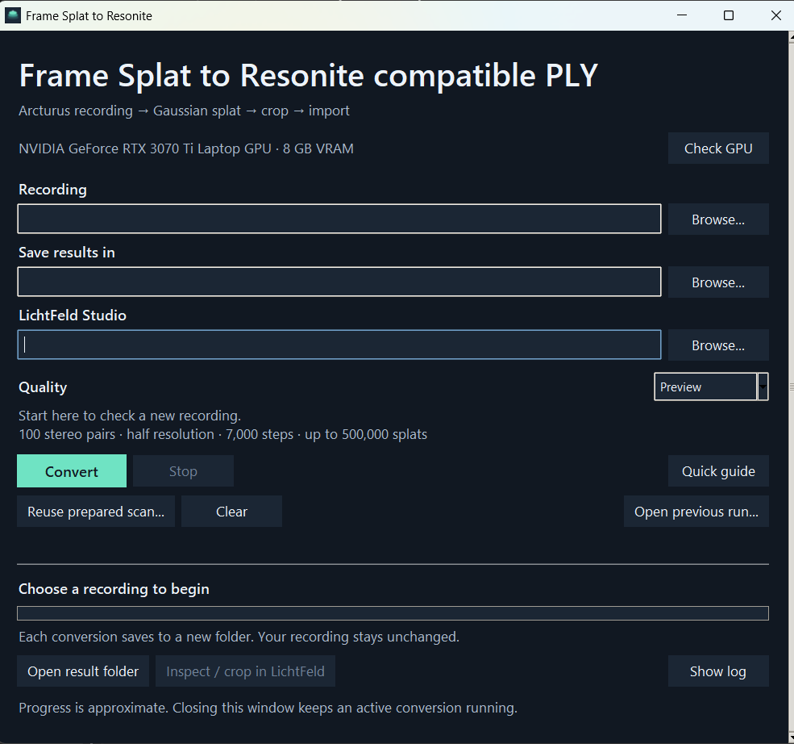

# AI Disclosure
All the scripts here where created with GPT Astra.

Arcturus do not provide a workflow for windows and their camera for the frame. Hence the creation of this tool to provide an easy to use GUI that allows you to turn a Spatial Video captured by the color passthrough addon for the frame into a splat that is useable in resonite. 

The app extracts stereo images, reconstructs camera positions with COLMAP, and trains a PLY in LichtFeld. Processing stays on your PC. Recordings are never overwritten.

## Set up once

1. Use **64-bit Windows and an NVIDIA GPU** with a working CUDA driver. 8 GB VRAM and 32 GB RAM are recommended. Start with Preview.
2. Install [Python 3.12, 64-bit](https://www.python.org/downloads/release/python-31210/). Keep **Tcl/Tk** and the **Python launcher** enabled.
3. Download and extract [LichtFeld Studio for Windows](https://github.com/MrNeRF/LichtFeld-Studio). Keep its whole folder together.
4. Extract this project to a writable folder. Double-click **Setup.cmd**. It downloads the pinned reconstruction tools and Python packages.
5. Double-click **Start.cmd**. Browse to your `LichtFeld-Studio.exe` once.

Tested with LichtFeld build **5a92bff**. Other versions may change its command-line options. The app checks those options before reconstruction. This is a community Windows adapter, not an official Arcturus release.

## Convert

1. Sync your recording with **Arcturus Vision Sync**. Use the original MP4, not a side-by-side video export.
2. Choose the recording, output folder and quality. Click **Convert**.
3. When finished, click **Inspect / crop in LichtFeld**.
4. Right-click the model → **Add Crop Box**. Right-click the box → **Fit to Scene (Trimmed)**. Adjust it around what you want to keep, then **Apply**.
5. **File → Export → PLY**. Save a new file.
6. Import that file into Resonite as **Gaussian Splat**. Test without SPZ compression first.

| Quality | Use | Stereo pairs | Steps | Splat limit |
|---|---|---:|---:|---:|
| Preview | First test; half resolution | 100 | 7,000 | 500,000 |
| Detailed | Objects; full resolution | 150 | 30,000 | 1.5 million |
| Room | More viewpoints; full resolution | 300 | 30,000 | 1.5 million |

## Remember

- Walk slowly around a still subject. Capture overlapping views at different heights.
- Arcturus recommend 30fps for recordings intended for splatting.
- Crop unwanted background. Higher quality cannot recover unseen surfaces.
- A full 1.5-million-splat PLY is about **372 MB**. Cropping reduces it.
- Keep at least **12 GB free**; longer scans may need more. Keep the PC awake.
- **Reuse prepared scan** skips completed reconstruction and starts fresh training. It keeps the existing images; it does not resume training.
- A house needs separate, overlapping sections. The app does not stitch recordings.

License: [MIT](LICENSE). External tools keep their own licenses; see [THIRD_PARTY.md](THIRD_PARTY.md).
